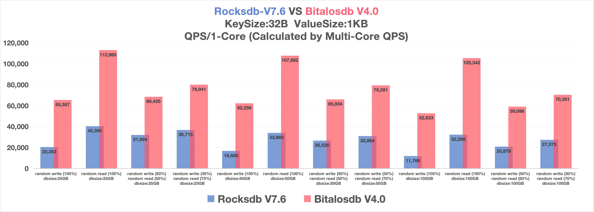

### Bitalosdb is a high-performance KV storage engine. [中文版](./README_CN.md)

## Introduction

- High-performance KV storage engine based on a brand-new I/O architecture and storage technology, focusing on solving the read and write amplification issues of LSM-Tree. As an alternative to RocksDB, both read and write performance have been greatly improved.

## Main Creator

- Author: Xu Ruibo(hustxurb@163.com), joined Zuoyebang in December 2018 (working till now), is responsible for live class middle platform and Zuoyebang platform, and leads the storage technology team to develop Bitalos from 0 to 1.

- Contributors: Xing Fu(wzxingfu@gmail.com), Li Jingchen(cokin.lee@outlook.com), Lu Wenwei(422213023@qq.com), Liu Fang(killcode13@sina.com)

## Key Technology

- High-performance compressed indexing technology: bitalostree, a B+ tree based on ultra-large pages, with innovative index compression technology that eliminates write amplification of B+ trees and maximizes read performance.

- High-performance KV index with vector computation implemented based on ASM assembly, delivering significantly improved performance.

- High-performance K-KV index, a multi-level vector index based on bitalostree that balances index compression ratio and retrieval performance.

- High-performance KV separation technology: bithash, based on a compact index structure, with O(1) retrieval efficiency and capable of independent GC.

- High-performance storage structure that compresses Redis composite data types, significantly reducing I/O costs and improving system throughput.

- Hot-cold data separation technology: bitalostable, which supports cold data storage, improves data compression ratio, reduces index memory consumption, and achieves more reasonable resource utilization (the open-source stable version provides basic functions, while the enterprise edition supports more comprehensive hot-cold separation).

## Performance

- As an alternative to RocksDB, BitalosDB was benchmarked against the stable version of RocksDB released in the same period.

### Hardware

```
CPU:    Intel(R) Xeon(R) Platinum 8255C CPU @ 2.50GHz
Memory: 384GB
Disk:   2*3.5TB NVMe SSD
```

### Program

- Benchmark thread number: 8

- Program cpu cgroup: 8 core

- Comparison standard: QPS on single-core (multi-core QPS / core number), single-core performance reflects cost advantage better.

### Data

- Key-value spec: key-size=32B、value-size=1KB

- Comparison dimensions: Total data size(25/50/100GB) * IO ratio(100% random write, 100% random read, 50% random write + 50% random read, 30% random write + 70% random read)

### Config

- rocksdb

```
Memtable：256MB
WAL：enable
Cache：8GB
TargetFileSize：256M
L0CompactTrigger：8
L0StopWritesTrigger：24
```

- bitalosdb

```
Memtable：256MB
WAL：enable
Cache：disable
```

### Result

- QPS



## Document

Technical architecture and documentation, refer to the official website: bitalos.zuoyebang.com