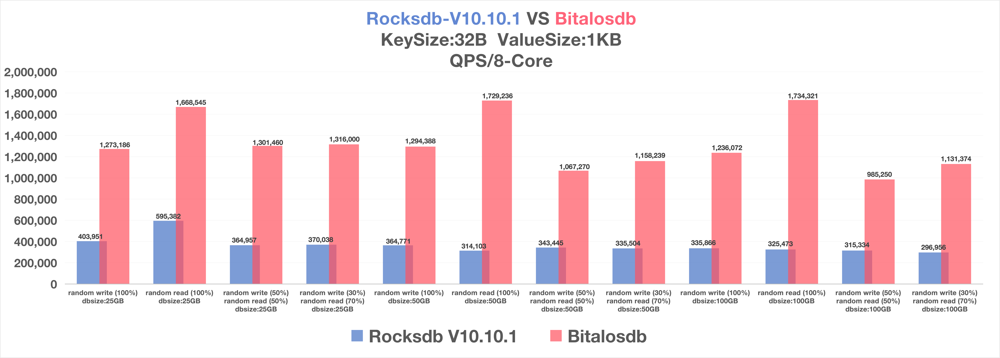

## 简介

- 高性能KV存储引擎，基于全新IO架构及存储技术，重点解决LSM-Tree的读写放大问题。作为rocksdb的替代品，读写性能均有大幅提升。

## 主创

- 作者：徐锐波(hustxurb@163.com)，2018年12月加入作业帮，在职至今，先后负责直播课中台研发及作业帮平台研发；同时带领存储技术团队，从0到1研发Bitalos

- 贡献者：幸福(wzxingfu@gmail.com)、李景晨(cokin.lee@outlook.com)、卢文伟(422213023@qq.com)、刘方(killcode13@sina.com)

## 关键技术
- 高性能压缩索引技术：bitalostree，基于超大page的b+ tree，创造性的索引压缩技术，消除b+ tree的写放大，并将读性能发挥到极致.

- 高性能KV索引，基于ASM汇编实现向量计算，性能显著提升.

- 高性能K-KV索引，基于bitalostree的多级向量索引，兼顾索引压缩率与检索性能.

- 高性能KV分离技术：bithash，基于紧凑型索引结构，具备O(1)检索效率，可独立完成GC.

- 高性能存储结构，压缩redis复合数据类型，大幅降低IO成本，提升系统吞吐.

- 冷热数据分离技术:bitalostable，承载冷数据存储，提升数据压缩率，减少索引内存消耗，实现更合理的资源利用（开源稳定版具备基础功能，企业版支持更全面的冷热分离）.

## 性能报告

- bitalosdb作为rocksdb的替代品，选取 2025年10月发布的bitalosdb 与 2026年2月发布的rocksdb v10.10.1 做性能对比。

### 硬件

```
CPU:    Intel(R) Xeon(R) Platinum 8255C CPU @ 2.50GHz
Memory: 384GB
Disk:   2*3.5TB NVMe SSD
```

### 程序

- 压测线程：8

- CPU限制：8核

### 数据

- 单条数据：key-size：32B、value-size：1KB

- 对比维度：数据总量（25GB、50GB、100GB） x 读写占比（100%随机写、100%随机读、50%随机写+50%随机读、30%随机写+70%随机读）

### 配置

- rocksdb

```
Memtable：1GB
WAL：disable
Cache：8GB
TargetFileSize：128MB
MinBlobSize：256B
```

- bitalosdb

```
Memtable：1GB
WAL：disable
Cache：disable
```

### 结果

- QPS



## 文档

- 技术架构及文档，参考官网：bitalos.zuoyebang.com